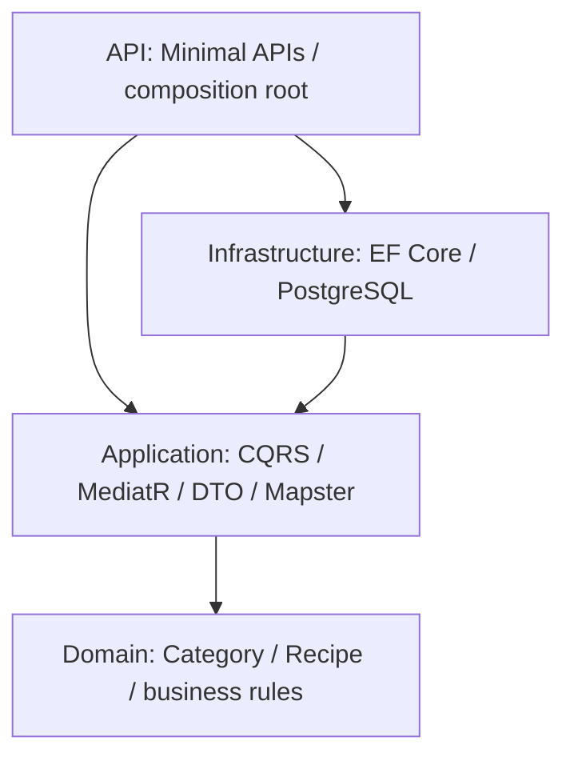

# Bài tập Chương 1 — Culinary Blog

Môn: Phát triển Ứng dụng Web Nâng cao (PTUDWNC).
Đề gốc: `De_bai_Chuong_01.pdf`, 27 trang. Bài tập thực hành ở trang 25; câu hỏi thảo luận ở trang 24–25.

## Nội dung

- Bài 1: solution .NET 10 gồm Domain, Application, Infrastructure và API; Category.Create/Update; MediatR, Mapster, EF Core/PostgreSQL, Scalar.
- Bài 2: Recipe đủ thuộc tính, enum Difficulty, CQRS, DTO chi tiết chứa Category, Fluent configuration và migration.
- Bài 3: 10 thao tác CRUD + endpoint danh mục/công thức lồng nhau; OpenAPI metadata; bộ lọc; file HTTP và kiểm thử tự động.
- `docs/Tra_loi_thao_luan.md`: trả lời 8 câu hỏi và giải thích những điểm cần điều chỉnh trong giáo trình.
- `docs/Thiet_ke_API.md`: thiết kế contract API.
- `docs/Ket_qua_kiem_thu.md`: kết quả chạy thực tế.

## Chạy trên máy hiện tại

Đã có .NET SDK 10.0.401, PostgreSQL 18.6 qua Postgres.app và pgAdmin 4.
Bật Postgres.app nếu PostgreSQL chưa chạy. Mở Terminal trong thư mục chứa README này:

```sh
dotnet tool restore
dotnet restore
dotnet build --no-restore
dotnet ef database update --project src/CulinaryBlog.Infrastructure --startup-project src/CulinaryBlog.API -- --environment Development
dotnet run --project src/CulinaryBlog.API --launch-profile http
```

- Scalar: http://localhost:5081/scalar/v1
- OpenAPI JSON: http://localhost:5081/openapi/v1.json
- API: http://localhost:5081/api/v1/categories

Database bài tập: `ptudwnc_chuong01`, host `localhost`, port `5432`, user `nthtam`.
Cấu hình local nằm trong `src/CulinaryBlog.API/appsettings.Development.json`; phù hợp cơ chế xác thực local của Postgres.app trên máy này.
Trên máy khác, đặt biến môi trường `ConnectionStrings__DefaultConnection` theo tài khoản PostgreSQL của máy đó.
Không sử dụng database `culinary_blog` có sẵn.

Trong pgAdmin: Register → Server, đặt tên PTUDWNC Chương 1; Connection: localhost / 5432 / maintenance database postgres / username nthtam. Database → ptudwnc_chuong01 → Schemas → public → Tables.

## Kiểm thử

Khi API đang chạy:

```sh
python3 tests/integration_test.py
```

Script tạo dữ liệu riêng có UUID trong tên, kiểm tra phản hồi và dọn chính dữ liệu do nó tạo trong khối finally.
Mở `CulinaryBlog.http` bằng VS Code REST Client để gửi từng yêu cầu theo thứ tự. ID được lấy từ phản hồi POST bằng named requests.

## Kiến trúc và phạm vi



Domain không phụ thuộc package ngoài. Application không tham chiếu Infrastructure.
Theo code mẫu trang 8 và 15, IApplicationDbContext dùng DbSet và handler dùng async LINQ EF Core, nên Application **có phụ thuộc EF Core**. Đây là biến thể thực dụng của Clean Architecture; không thể gọi là hoàn toàn độc lập framework. Muốn độc lập tuyệt đối cần đổi sang repository/query abstraction.
API tham chiếu Infrastructure chỉ để đăng ký DI tại Program.cs (composition root), giống bước 1 trang 21–22; endpoint chỉ gửi command/query qua ISender.

Chương 1 chưa làm đăng nhập: AuthorId nhận trong body và chưa có bảng User. Đây là ranh giới theo bài tập, phần xác thực/phân quyền thuộc chương 2.
CRUD dùng GET/POST/PUT/DELETE; PATCH được trình bày trong thảo luận, đề thực hành không yêu cầu triển khai.
Không tự động migrate mỗi lần chạy API. Migration được áp dụng bằng lệnh riêng phía trên.
