# ERD — Culinary Blog (ĐỐI CHIẾU TRỰC TIẾP SRS v1.0.0)

> Nguồn: SRS_Culinary_Blog_v1.0.0.pdf — **Chương 6.4 (ERD tóm tắt)** và **Chương 7 (Mô hình Dữ liệu, tr.54–60)**.
> SRS chỉ mô tả ERD bằng bảng chữ, **không có hình vẽ** → sơ đồ dưới đây là bản vẽ chính thức của nhóm.
> DB: PostgreSQL 16, EF Core 10 Code First. Mọi entity nghiệp vụ kế thừa `BaseEntity` + Soft Delete;
> **RefreshToken là ngoại lệ** (cấu trúc riêng, xem ghi chú D24).

```mermaid
erDiagram
    CATEGORY          ||--o{ RECIPE            : "1:N — ON DELETE RESTRICT"
    APPLICATION_USER  ||--o{ RECIPE            : "Author 1:N (AuthorId → AspNetUsers.Id)"
    APPLICATION_USER  ||--o{ REFRESH_TOKEN     : "1:N — ON DELETE CASCADE"
    RECIPE            ||--|| RECIPE_NUTRITION   : "1:1 Owned (cột Nutrition_* trong Recipes)"
    RECIPE            ||--o{ RECIPE_STEP        : "1:N — ON DELETE CASCADE"
    RECIPE            ||--o{ RECIPE_INGREDIENT  : "1:N — ON DELETE CASCADE"
    RECIPE            ||--o{ RECIPE_IMAGE       : "1:N — ON DELETE CASCADE"

    APPLICATION_USER  ||--o{ ASPNET_USER_ROLE  : "Identity"
    ASPNET_ROLE       ||--o{ ASPNET_USER_ROLE  : "Identity"

    CATEGORY {
        uuid        Id PK "gen_random_uuid()"
        varchar100  Name UK "NOT NULL, UNIQUE"
        varchar120  Slug UK "NOT NULL, UNIQUE, IDX_Category_Slug"
        text        Description "NULL"
        varchar500  ImageUrl "NULL"
        int         OrderIndex "NOT NULL DEFAULT 0 — thứ tự navigation"
        _           BaseEntity "+ Id,CreatedAt,UpdatedAt,IsDeleted,RowVersion"
    }

    RECIPE {
        uuid        Id PK
        varchar200  Title "NOT NULL — IDX_Recipe_Title (GIN trigram, optional)"
        varchar220  Slug UK "NOT NULL UNIQUE — không đổi sau Publish"
        text        Description "NOT NULL (<=2000, SEO meta)"
        text        Instructions "NOT NULL — legacy markdown; chi tiết dùng RecipeSteps (D28: default '')"
        int         PrepTime "NOT NULL CHECK > 0"
        int         CookTime "NOT NULL CHECK >= 0 (0 = no-cook)"
        int         Servings "NOT NULL CHECK > 0"
        smallint    Difficulty "NOT NULL DEFAULT 1 — 1=Easy,2=Medium,3=Hard,4=Expert"
        smallint    Status "NOT NULL DEFAULT 0 — 0=Draft,1=Published,2=Archived"
        uuid        CategoryId FK "NOT NULL → Categories.Id (RESTRICT)"
        varchar450  AuthorId FK "NOT NULL → AspNetUsers.Id"
        tsvector    SearchVector "NULL, IDX_Recipe_Search (GIN) — TRIGGER theo Title/Description, unaccent"
        timestamptz PublishedAt "NULL, IDX_Recipe_PublishedAt"
        _           BaseEntity "+ Id,CreatedAt,UpdatedAt,IsDeleted(partial idx),RowVersion"
    }

    RECIPE_NUTRITION {
        decimal8_2  Calories "kcal/serving, NULL"
        decimal8_2  Protein "g/serving, NULL"
        decimal8_2  Carbohydrates "g/serving, NULL"
        decimal8_2  Fat "g/serving, NULL"
        decimal8_2  Fiber "g/serving, NULL"
        decimal8_2  Sodium "mg/serving, NULL"
    }

    RECIPE_STEP {
        uuid        Id PK
        uuid        RecipeId FK "NOT NULL → Recipes.Id (CASCADE)"
        int         StepNumber "NOT NULL CHECK > 0 — UNIQUE(RecipeId,StepNumber)"
        varchar200  Title "NOT NULL"
        text        Description "NOT NULL"
        int         TimerMinutes "NULL CHECK >= 0"
        varchar500  ImageUrl "NULL (MinIO)"
        _           BaseEntity "+ BaseEntity"
    }

    RECIPE_INGREDIENT {
        uuid        Id PK
        uuid        RecipeId FK "NOT NULL → Recipes.Id (CASCADE)"
        varchar200  Name "NOT NULL"
        decimal10_3 Quantity "NULL (nguyên liệu 'vừa đủ')"
        varchar50   Unit "NULL"
        varchar500  Notes "NULL"
        int         OrderIndex "NOT NULL DEFAULT 0"
        _           BaseEntity "+ BaseEntity"
    }

    RECIPE_IMAGE {
        uuid        Id PK
        uuid        RecipeId FK "NOT NULL → Recipes.Id (CASCADE)"
        varchar500  OriginalUrl "NOT NULL (MinIO)"
        varchar500  MediumUrl "NULL — 800x600 (FR-JOB-002)"
        varchar500  ThumbnailUrl "NULL — 300x300 (FR-JOB-002)"
        varchar200  AltText "NULL"
        boolean     IsPrimary "NOT NULL DEFAULT false — đúng 1 primary/Recipe"
        int         OrderIndex "NOT NULL DEFAULT 0"
        _           BaseEntity "+ BaseEntity (LƯU Ý: image dùng HARD DELETE — FR-RCP-008)"
    }

    APPLICATION_USER {
        varchar450  Id PK "IdentityUser<string>, bảng AspNetUsers"
        varchar100  DisplayName "custom, NOT NULL"
        varchar500  AvatarUrl "custom, NULL (từ Google Avatar)"
        text        Bio "custom, NULL"
        boolean     IsActive "custom, NOT NULL DEFAULT true (ban/deactivate)"
        timestamptz CreatedAt "custom, NOT NULL DEFAULT NOW()"
        _           Identity "Email,UserName,PasswordHash,SecurityStamp,LockoutEnd,AccessFailedCount..."
    }

    REFRESH_TOKEN {
        uuid        Id PK
        varchar450  UserId FK "NOT NULL → AspNetUsers.Id (CASCADE)"
        varchar64   TokenHash UK "NOT NULL UNIQUE, IDX_RefreshToken_Hash (SHA-256, không lưu raw)"
        timestamptz ExpiresAt "NOT NULL (7 ngày)"
        timestamptz RevokedAt "NULL = còn hiệu lực"
        varchar64   ReplacedByTokenHash "NULL — trace token family (rotation)"
        timestamptz CreatedAt "NOT NULL DEFAULT NOW()"
        varchar45   CreatedByIp "NULL — audit"
    }

    ASPNET_ROLE {
        varchar450  Id PK "AspNetRoles (Guest/Author/Admin)"
        varchar256  Name "NormalizedName"
    }
    ASPNET_USER_ROLE {
        varchar450  UserId FK "→ AspNetUsers.Id"
        varchar450  RoleId FK "→ AspNetRoles.Id"
    }
```

## 1. Bảng quan hệ (đúng theo 6.4)

| Thực thể | Quan hệ | Hành vi xóa | Bảng PostgreSQL |
|---|---|---|---|
| Recipe → RecipeStep | 1:N | CASCADE | `RecipeSteps` |
| Recipe → RecipeIngredient | 1:N | CASCADE | `RecipeIngredients` |
| Recipe → RecipeImage | 1:N | CASCADE (nhưng xóa lẻ 1 ảnh = **hard delete**) | `RecipeImages` |
| Recipe → RecipeNutrition | 1:1 **Owned** | (cột trong Recipes) | `Recipes.Nutrition_*` |
| Recipe → Category | N:1 | **RESTRICT** (chặn xóa category còn recipe) | `Categories` |
| Recipe → ApplicationUser (Author) | N:1 | — | `AspNetUsers` |
| ApplicationUser → RefreshToken | 1:N | CASCADE | `RefreshTokens` |
| Category → Recipe | 1:N | RESTRICT | `Categories` |
| RefreshToken → ApplicationUser | N:1 | CASCADE | `RefreshTokens` |

## 2. Chỉ mục (index) theo SRS
`IDX_Recipe_Slug` (UNIQUE B-tree), `IDX_Recipe_CategoryId`, `IDX_Recipe_AuthorId`, `IDX_Recipe_Status`,
`IDX_Recipe_PublishedAt`, `IDX_Recipe_Difficulty`, `IDX_Recipe_Search` (GIN, tsvector),
`IDX_Recipe_IsDeleted` (partial), `IDX_Recipe_Title` (GIN trigram — **optional**);
`IDX_Category_Slug` (UNIQUE); `IDX_RefreshToken_Hash` (UNIQUE); UNIQUE(RecipeId, StepNumber) trên RecipeSteps.

## 3. Đối tượng Domain không phải bảng (tr. 50–52)
- **Owned Entity:** `RecipeNutrition` (6 cột `Nutrition_*` trong `Recipes`).
- **Value Objects:** `Slug`, `EmailAddress` (hiện thực dưới dạng cột, không phải bảng).
- **Domain Events** có được nhắc tới (kiến trúc), không tạo bảng.
- **Identity satellites** (Identity tự sinh): `AspNetRoles`, `AspNetUserRoles`, `AspNetUserClaims`,
  `AspNetRoleClaims`, `AspNetUserLogins` (Google OAuth), `AspNetUserTokens`.
- **Hangfire** tự tạo schema/bảng job riêng trong cùng PostgreSQL (thư viện quản lý, không phải entity nghiệp vụ).

## 4. Ngoài phạm vi v1 (KHÔNG có bảng — tr. 268–269)
Comment/Rating, Bookmark/Favorite, thông báo realtime → **không** đưa vào ERD.

## 5. Chênh lệch đã sửa so với bản nháp trước & cần chỉnh trong code C1
1. **Difficulty enum khởi đầu từ 1** (Easy=1..Expert=4, DEFAULT 1). Code `RecipeDifficulty` cũ đánh Easy=0 → **phải sửa**.
2. **UpdatedAt là NULLABLE** (`timestamptz NULL`, set khi update). `BaseEntity.UpdatedAt` trong code đang non-null → nên đổi `DateTime?` và chỉ set khi Modified.
3. **RowVersion**: SRS ghi `bytea` + chú thích `[Timestamp]`/timestamp. Npgsql không tự sinh như SQL Server → giữ phương án D19 (interceptor gán token opaque, IsConcurrencyToken). Ghi rõ khác biệt annotation trong ADR.
4. **RefreshToken KHÔNG mang IsDeleted/RowVersion/UpdatedAt** — là bảng riêng (D24), không phải BaseEntity đầy đủ. Đã phản ánh.
5. **Index**: dùng index riêng cho Status và PublishedAt (SRS liệt kê tách), thêm `IDX_Recipe_IsDeleted` partial; `IDX_Recipe_Title` GIN trigram là optional.
6. **RecipeImage hard delete** khi xóa lẻ (FR-RCP-008) — đã đúng trong thiết kế (child không ISoftDeletable).
7. **Instructions** là "legacy field" markdown, chi tiết dùng RecipeSteps; NOT NULL, mặc định "" (D28) — đã đúng.
