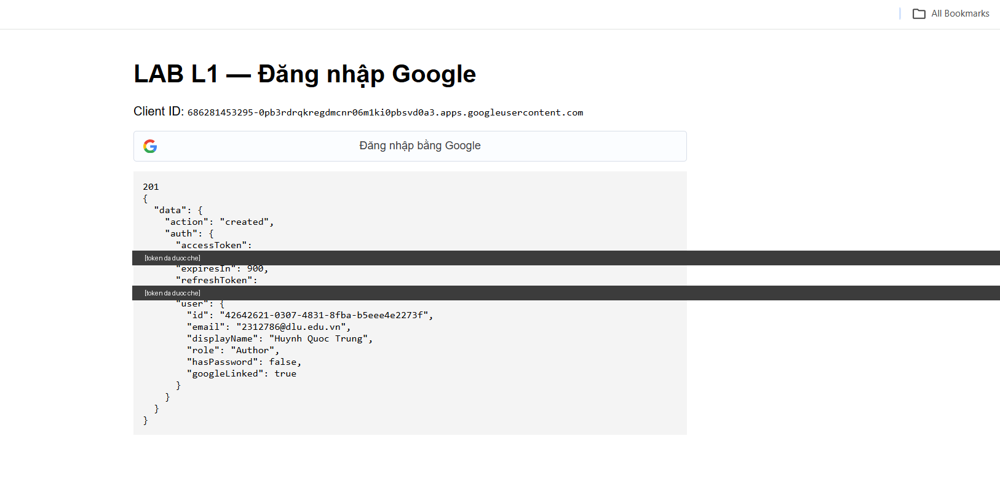
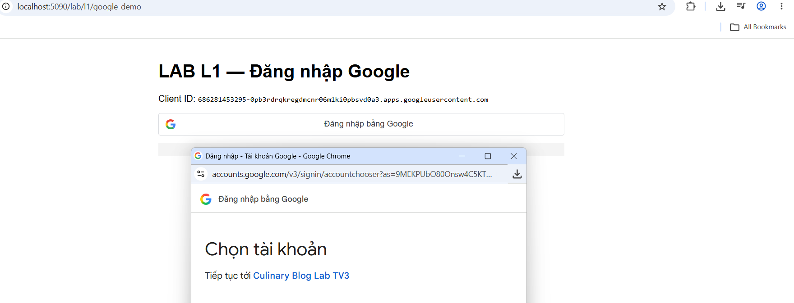
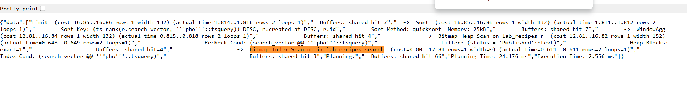
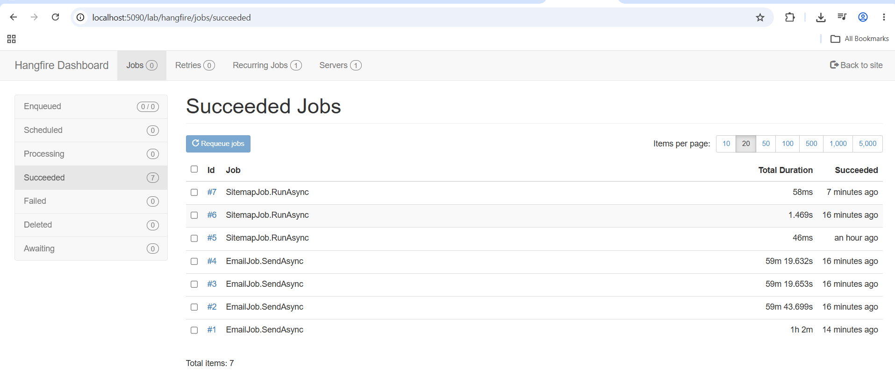
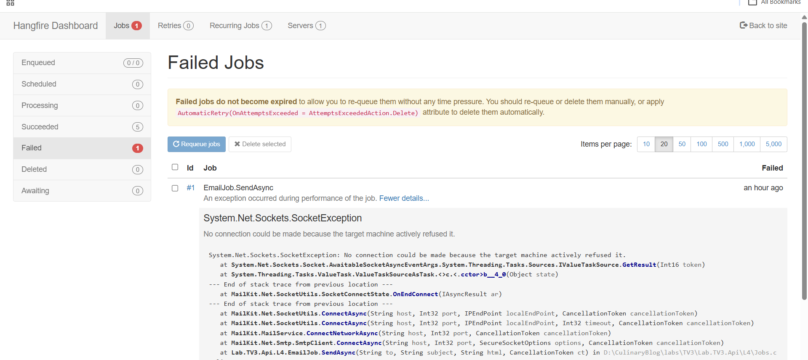
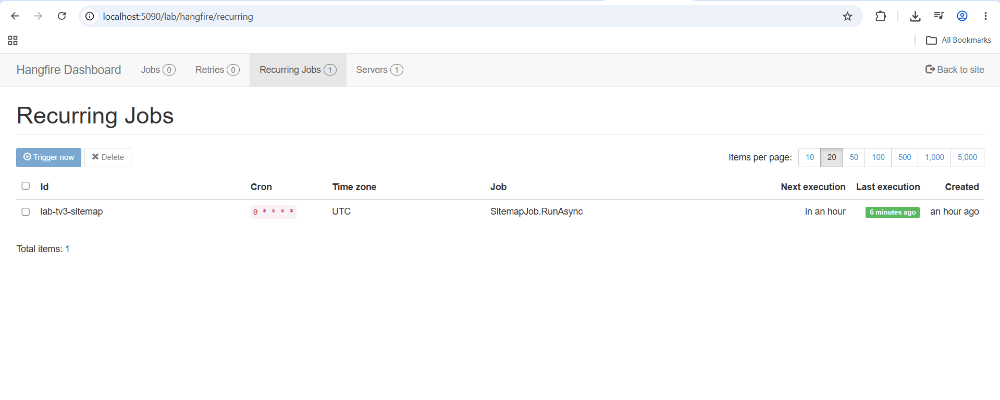
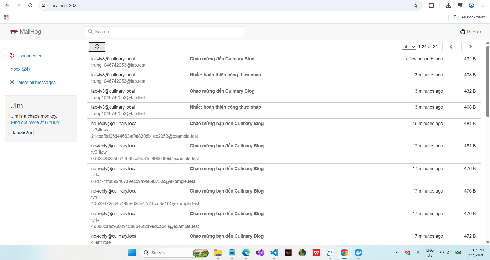

# Evidence LAB C6 — Tuần 3 — TV3 Huỳnh Quốc Trung (2312786)

Nhánh: `practice/TV3/labs` · Tag: `TV3-LAB-L1`, `TV3-LAB-L3`, `TV3-LAB-L4` · Code: `labs/TV3/` · Reviewer: Nguyễn Thanh Tâm

Quy định áp dụng (mục 5.1 PHAN_CHIA_CONG_VIEC_6_TUAN): nhánh riêng, DB `lab_tv3*` / bucket `lab-tv3` / schema Hangfire `lab_tv3_hangfire` riêng,
stack thật (PostgreSQL 16, Redis 7, MinIO, Mailhog, Google Identity); mock chỉ dùng cho unit/error test.

| K | Nội dung LAB | Code | Minh chứng | Trạng thái |
|---|---|---|---|---|
| K08 | Register/login PBKDF2 (Identity V3 ≥100k vòng), JWT 15', refresh 512-bit lưu SHA-256, rotation, logout thu hồi, lỗi đăng nhập chung | `L1/AuthEndpoints.cs`, `L1/TokenService.cs` | `L1AuthTests` · test tay: register/me, 401 `INVALID_CREDENTIALS` chung cho sai mật khẩu và email không tồn tại, refresh sau logout bị từ chối | ✅ |
| K09 | Google callback → verify ID token (chữ ký/aud/exp) → tạo mới / đăng nhập / liên kết theo email đã xác minh; chặn chiếm tài khoản | `L1/Google.cs`, `/lab/l1/google`, `/lab/l1/google-demo` | `L1AuthTests` (5 test) · **Google thật** với OAuth Client riêng, tài khoản @dlu.edu.vn → `201 created` — ảnh 01, 02 | ✅ |
| K11 | tsvector trigger (A/B/C), GIN, unaccent, `plainto_tsquery` AND, `ts_rank`, lọc + phân trang, không lộ Draft | `LabDb.cs`, `L3/SearchEndpoints.cs` | `L3SearchTests` · EXPLAIN: `Bitmap Index Scan on ix_lab_recipes_search` — ảnh 03 · `k6/search.js` | ✅ |
| K12 | Redis cache-aside (version key), OutputCache tag, invalidation khi sửa, Redis chết → fallback DB | `L3/RecipeCache.cs` | `Search_is_cached_then_invalidated_after_update` (MISS→HIT→MISS) · `L3RedisFallbackTests` (`X-Cache: BYPASS`) | ✅ |
| K13 | Upload 4 MIME theo magic bytes, biên đúng 5 MiB, key GUID + đuôi theo nội dung, delete không mồ côi | `L4/ImageValidator.cs`, `L4/MediaEndpoints.cs`, `L4/ObjectStorage.cs` | unit magic bytes/biên · file giả `.png` → 422 `FILE_TYPE_INVALID` · upload/resize/delete trên MinIO thật | ✅ |
| K14 | Hangfire fire-and-forget, delayed, recurring (sitemap mỗi giờ), retry 3 lần, lưu PostgreSQL sống qua restart | `L4/Jobs.cs`, `Program.cs` | Job tạo khi Mailhog tắt → hết 3 lần retry → Failed (ảnh 05) → app restart → Requeue → Succeeded (ảnh 04, job #1 tổng 1h 2m); recurring sitemap (ảnh 06) | ✅ |
| K15 | SMTP Mailhog (MailKit), resize 300×300 / 800×600, sitemap XML chỉ Published | `L4/Jobs.cs` | Mailhog nhận email welcome/reminder — ảnh 07 · resize trên MinIO thật · `sitemap.xml` chỉ URL Published | ✅ |

## Kết quả chạy

```
dotnet test labs/TV3/Lab.TV3.Tests --filter "Infra!=docker"          -> 42/42 passed (không cần Docker)
$env:LAB_REDIS="localhost:6379"; dotnet test labs/TV3/Lab.TV3.Tests  -> tất cả passed (Redis + MinIO + Mailhog thật)
```

## Ảnh minh chứng

### 01 — Google thật: `201 created` (token đã che)


### 02 — Màn hình chọn tài khoản Google cho app "Culinary Blog Lab TV3"


### 03 — EXPLAIN (ANALYZE): truy vấn FTS dùng GIN `ix_lab_recipes_search`


### 04 — Hangfire: 7 job Succeeded (job #1 tổng 1h 2m = thất bại lúc Mailhog tắt → requeue → thành công)


### 05 — Hangfire: job #1 Failed sau 3 lần retry (`SocketException` khi Mailhog chưa chạy)


### 06 — Recurring job `lab-tv3-sitemap` (cron `0 * * * *`)


### 07 — Mailhog nhận email từ job nền


## Ghi chú

- MinIO đã gỡ image khỏi Docker Hub và quay.io (09/2026) → dùng mirror `coollabsio/minio:RELEASE.2025-10-15T17-29-55Z` (đóng băng, chấp nhận cho đồ án).
- ImageSharp ghim 3.1.x (Six Labors Split License, không cần license key).
