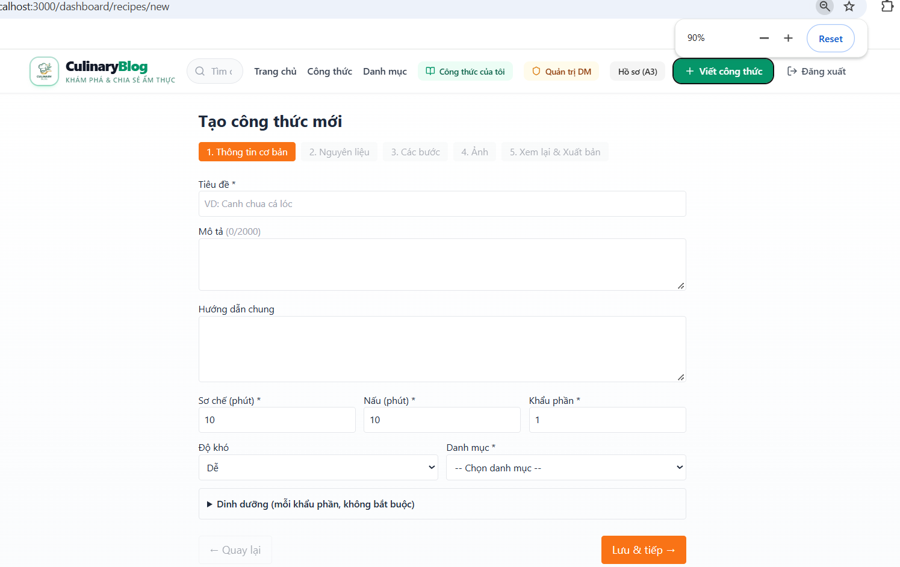
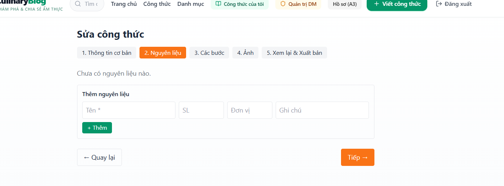
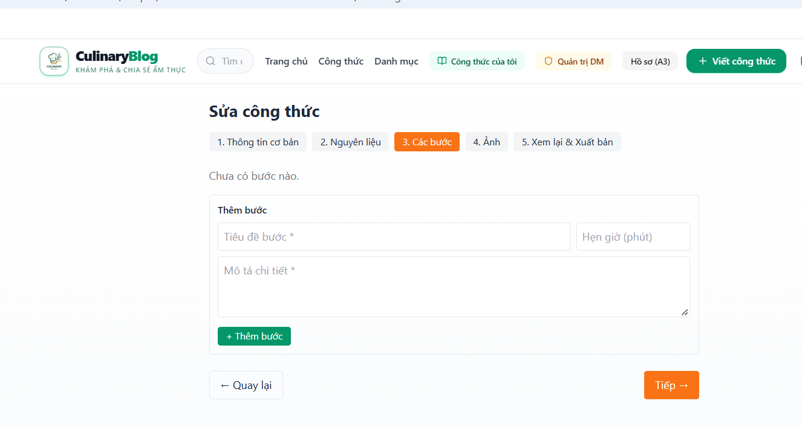
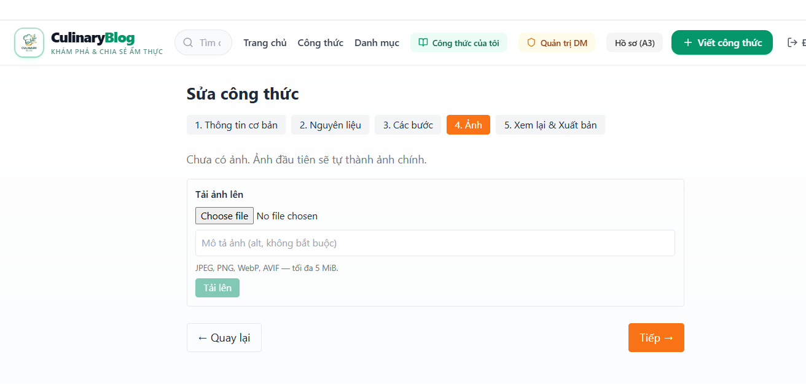
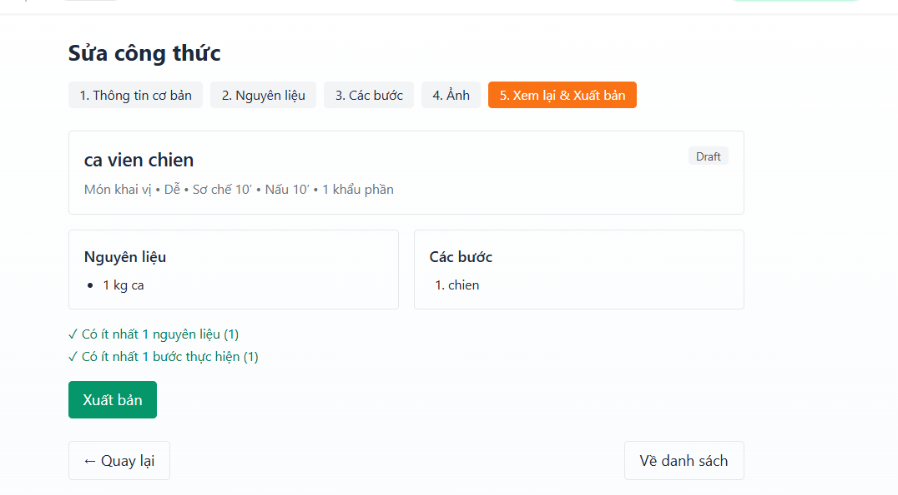
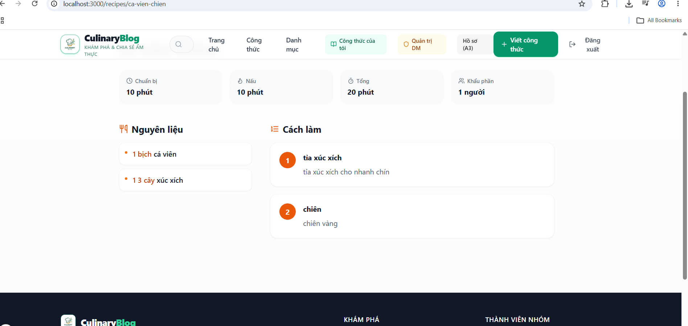

# Evidence TUẦN 3 — TV3 Huỳnh Quốc Trung (2312786) — Soạn thảo công thức

Nhánh: `2312786_HuynhQuocTrung_C4-recipe-ui` · Pull request: C4 → `main` (reviewer: Nguyễn Thanh Tâm) · CI: xanh

## Công việc SP

| Task | Nội dung | Evidence key | Trạng thái |
|---|---|---|---|
| C4 | Dashboard `/dashboard/recipes` (lọc, đếm theo trạng thái), xoá mềm | TV3-K16 | ✅ |
| C4 | Wizard 5 bước `/dashboard/recipes/new` + `/[id]/edit`: thông tin + dinh dưỡng, nguyên liệu, các bước (đổi thứ tự), ảnh (API TV4), xem lại & xuất bản; chống tạo nháp trùng | TV3-K05, TV3-K17 | ✅ |
| C4 | Optimistic update + rollback; conflict reload khi RowVersion lệch | TV3-K07, TV3-K17 | ✅ |
| C4 | Trang chi tiết ISR + on-demand revalidate sau khi lưu (`/api/revalidate`) | TV3-K12, TV3-K16 | ✅ |
| C4 | JSON-LD Schema.org Recipe (không rating giả), nút Sửa cho tác giả, độ khó tiếng Việt | TV3-K19 | ✅ |
| C4 | a11y: aria-label, aria-current, role="alert"; header Công thức của tôi / Viết công thức / Đăng xuất | TV3-K18 | ✅ |
| C5 | Refresh token concurrency (gộp trong nhánh C4) | TV3-K08 | ✅ |
| C7 | `RecipeAuthoringFlowTests` trên PostgreSQL + JWT thật: tạo → nguyên liệu/bước → đổi thứ tự → xuất bản; 422 thiếu thành phần; 401 chưa đăng nhập | TV3-K21 | ✅ |

## Lỗi backend phát hiện và sửa trong tuần

| Lỗi | Nguyên nhân | Sửa |
|---|---|---|
| `AuthorPolicy`/`AdminPolicy` luôn 403 | `MapInboundClaims = false` nhưng thiếu `RoleClaimType` | `RoleClaimType = "role"` |
| Thêm nguyên liệu/bước lỗi concurrency | EF coi Id Guid sinh ở domain là bản ghi cũ → UPDATE thay vì INSERT | `ValueGeneratedNever()` + migration rỗng cập nhật snapshot |
| Đổi thứ tự bước trả 500 | Unique (RecipeId, StepNumber) kiểm tra ngay sau từng UPDATE | Đánh số 2 pha trong transaction |
| CI `CHARSET` migration | File do `dotnet ef` sinh sai encoding | `dotnet format` |
| MinIO không pull được | MinIO gỡ image khỏi Docker Hub + quay.io | `coollabsio/minio:RELEASE.2025-10-15T17-29-55Z` |

## Kiểm thử

- `dotnet test CulinaryBlog.sln`: xanh (chạy cả trên DB rỗng giống CI)
- `dotnet format CulinaryBlog.sln --verify-no-changes`: sạch · frontend `tsc --noEmit`: sạch

## LAB C6

Xem nhánh `practice/TV3/labs` → `docs/evidence/TV3/LAB_C6_TUAN3.md` (L1, L3, L4 hoàn tất, Google thật đã xác minh).

## Ảnh minh chứng

### 01 — Wizard tạo công thức: thanh 5 bước + header mới (Công thức của tôi / Viết công thức / Đăng xuất)

### 02 — Bước 2: Nguyên liệu

### 03 — Bước 3: Các bước thực hiện

### 04 — Bước 4: Ảnh (JPEG/PNG/WebP/AVIF ≤ 5 MiB, nối API ảnh TV4)

### 05 — Bước 5: Xem lại & Xuất bản (checklist ≥1 nguyên liệu, ≥1 bước)

### 06 — Trang chi tiết công khai + header khi đã đăng nhập

> Bổ sung sau: ảnh upload thành công (ảnh chính), conflict reload (2 tab), JSON-LD (Ctrl+U).
